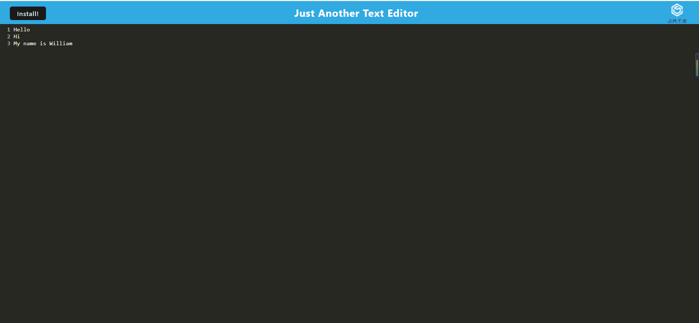

# Text-Editor
    This application is created for people who want to take notes or
    use it as code snippets without internet connection. This application
    is simple to install and use.

## Installation
    After you clone the repo into your local, run command "npm i" to
    install all the needed dependencies.

## Usage
    After you installed all the required packages, run "npm start"

## Live Site
    https://text.herokuapp.com/

## Mock Up
